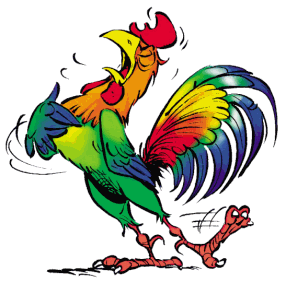

# Cookorico
Learn how to cook the funny way !

## Authors
* Salla DIAGNE ([@sallareznov](https://github.com/sallareznov))
* Johan DUFAUX ([@dufaux](https://github.com/dufaux))
* William LEEMANS ([@Ly4m](https://github.com/Ly4m))
* Dieulin MAMBOUANA ([@Dieulin](https://github.com/Dieulin))
* Antoine PHILIPPE ([@Mandrivia](https://github.com/Mandrivia))
* Ouamar SAIS ([@ouams](https://github.com/ouams))
* Sofiane YOUSFI ([@sofianekabylino](https://github.com/sofianekabylino))

# Abstract
*Cookorico* is a web application enabling a **gamification of the cooking learning process**.

The user can reimburse his cooking skills by making the recipes suggested by the application. Those various recipes are simple at the beginning, but the more the user's level is high, the more difficult the recipes will be. The application will always suggest the best recipe, depending on the user's level and tastes. An achievement (typically a finished recipe) enables the user to gain experience in order to reach the next level.

The application has a social dimension, which manifests itself by the fact that a user possesses an avatar, which varies with the user's level. It is also possible for a user to comment recipes made by other users.

The main purpose of this application is to set up an organized, playful and social environment.
